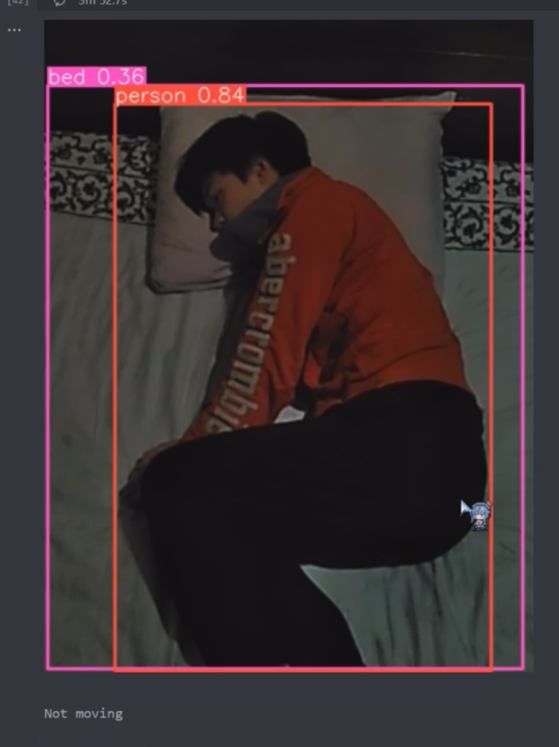
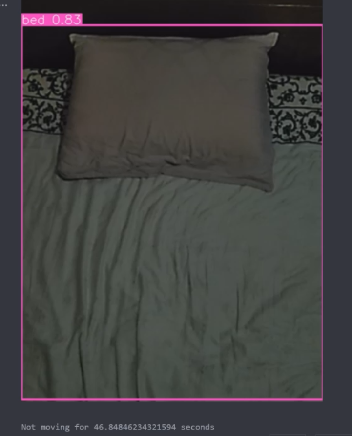
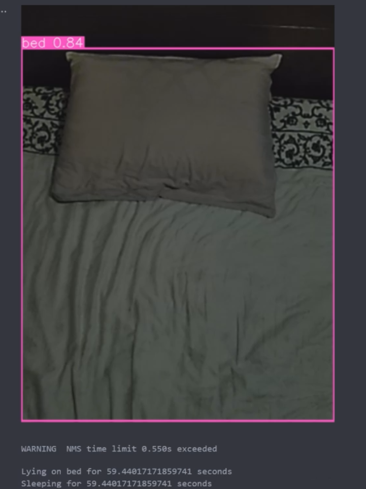

# aiot_bedroom
Project that aims to provide the best bedroom environment with AI and IoT

## 2 part 
- AI analysis
- Camera Connector
## AI analysis
- use the live_analysis.ipynb as the main program(For pc)
### IoT
Adurino project devices(ESP8266)\
Currenly control fan and lights\
use test.py to test and play with\
esp8826.ino is the program for the board\
## Camera Connector
- live_connection.py as the server(For pc)
- flir-cam-connect as the client source code(For Cat S60)

## More Details
Look at the project documents
- Poster(Finished)
    - [youtube link](https://youtu.be/l8e21IzSXhs)
- Pitch deck(Finished)
- Learning Summary(Finished)

## Hardware
Current using Cat S60(inbuilt flir camera), can accept more hardware in the future
