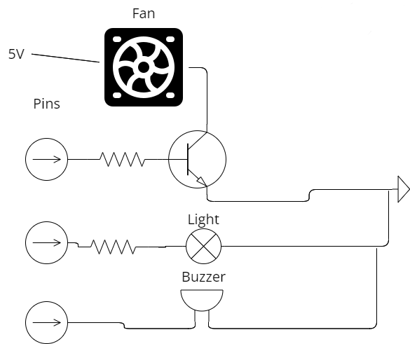

# IoT
> Using D1 mini (ESP8266)
## Setup Arduino ide
Follow instruction from [official repository](https://github.com/esp8266/Arduino)
## Main program
- **esp8826/esp8826.ino** is the code for the D1 mini board
  - compile and flash it to it will done the job
  - The code should also work on other esp8826 boards
- **IoT.py** is the library for the ai_anlysis python code to connect and control the board.
## Testing
- **test.py** you can test the basic function of the board with it
## Example Setup

  
  

